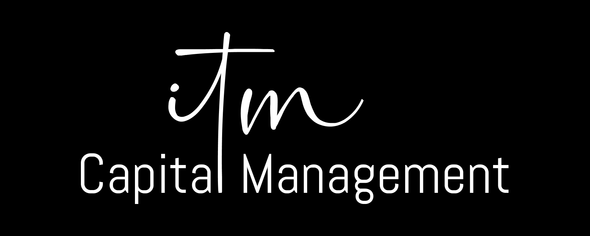

# ayyEYEE — Paper Trading Simulator

A Bloomberg terminal-style paper trading simulator that manages a **$1,000,000 portfolio** across 16 ETFs using a multi-agent AI architecture. Built for the IE MIF Deep Learning class competition.



## Features

- **Bloomberg-inspired UI** — Dark-themed Streamlit dashboard with IBM Plex Mono typography
- **Multi-agent pipeline** — Macro, Tactical, Risk, and Execution agents work in sequence
- **16-ETF universe** spanning 4 macro axes: Defensive/Cyclical, Growth/Value, High/Low Beta, US/EM
- **AI-powered macro allocation** — Claude analyzes FRED macroeconomic indicators to set strategic weights
- **Real-time price data** via yfinance
- **Risk management** — Position limits, trade caps, and sub-strategy concentration checks

## Architecture

```
FRED Macro Data → Macro Agent (Claude) → Target Allocation
                                              ↓
Live Prices → Tactical Agent → Trade Signals → Risk Agent → Execution Agent → Portfolio
```

| Agent | Role |
|---|---|
| **Macro Agent** | Reads FRED indicators (yield curve, CPI, unemployment, output gap, EPS, fed funds rate) and sets strategic ETF weights |
| **Tactical Agent** | Generates short-term trade signals (MA crossover, RSI, momentum) — *in development* |
| **Risk Agent** | Enforces position limits (40% max), no shorts, 3 trades/day, sub-strategy caps (70%) |
| **Execution Agent** | Executes trades, tracks cost basis, takes daily portfolio snapshots |

## ETF Universe

| Bucket | Ticker | Axes |
|---|---|---|
| DGHU | XBI | Defensive, Growth, High Beta, US |
| DGHE | EMQQ | Defensive, Growth, High Beta, EM |
| DGLU | XLV | Defensive, Growth, Low Beta, US |
| DGLE | INDA | Defensive, Growth, Low Beta, EM |
| DVHU | SDY | Defensive, Value, High Beta, US |
| DVHE | EELV | Defensive, Value, High Beta, EM |
| DVLU | SPLV | Defensive, Value, Low Beta, US |
| DVLE | EELV | Defensive, Value, Low Beta, EM |
| CGHU | SMH | Cyclical, Growth, High Beta, US |
| CGHE | EEM | Cyclical, Growth, High Beta, EM |
| CGLU | RSP | Cyclical, Growth, Low Beta, US |
| CGLE | CQQQ | Cyclical, Growth, Low Beta, EM |
| CVHU | XLE | Cyclical, Value, High Beta, US |
| CVHE | AVES | Cyclical, Value, High Beta, EM |
| CVLU | XLI | Cyclical, Value, Low Beta, US |
| CVLE | FEMS | Cyclical, Value, Low Beta, EM |

## Getting Started

### Prerequisites

- Python 3.10+
- [FRED API key](https://fred.stlouisfed.org/docs/api/api_key.html) (free)
- Anthropic API key (optional — can use manual Claude desktop workflow instead)

### Installation

```bash
git clone https://github.com/YOUR_USERNAME/ayyEYEE.git
cd ayyEYEE
pip install -r requirements.txt
```

### Configuration

Create a `.env` file in the project root:

```env
FRED_API_KEY=your_fred_key_here
ANTHROPIC_API_KEY=your_anthropic_key_here  # optional
```

### Run

```bash
streamlit run app.py
```

## Macro Analysis Workflow

Since the Anthropic API is optional, the project supports a manual workflow:

1. **Export data** — `python export_macro_data.py` fetches FRED indicators and generates `claude_prompt.txt`
2. **Analyze** — Paste `claude_prompt.txt` into Claude and get a JSON allocation response
3. **Apply** — Paste the JSON into `apply_manual_analysis.py` and run it to initialize positions
4. **View** — Open the Streamlit app to see your portfolio

## Trading Rules

- No short selling
- Max **40%** in any single position
- Max **3 trades per day**
- Sub-strategy concentration max **70%** (each of D/C/G/V/H/L/U/E)
- No peeking at future prices

## Built With

- [Streamlit](https://streamlit.io/) — Web UI
- [yfinance](https://github.com/ranaroussi/yfinance) — Market data
- [FRED API](https://fred.stlouisfed.org/) — Macroeconomic indicators
- [Claude](https://www.anthropic.com/claude) — AI macro analysis
- [Plotly](https://plotly.com/) — Interactive charts
- SQLite — Portfolio persistence

## Project Structure

```
ayyEYEE/
├── app.py                  # Streamlit Bloomberg terminal UI
├── database.py             # SQLite schema + CRUD
├── data_utils.py           # yfinance + FRED data fetching
├── macro_agent.py          # Claude-powered strategic allocation
├── tactical_agent.py       # Tactical signals (in development)
├── risk_agent.py           # Risk checks and position limits
├── execution_agent.py      # Trade execution + snapshots
├── export_macro_data.py    # FRED export + prompt generator
├── apply_manual_analysis.py # Manual Claude workflow applicator
├── requirements.txt
└── .gitignore
```
